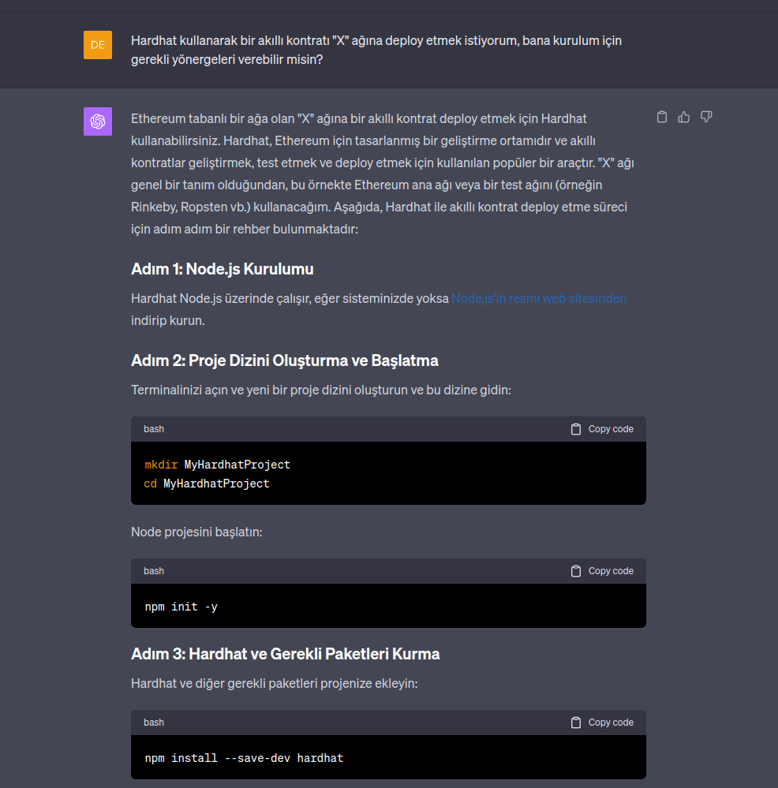
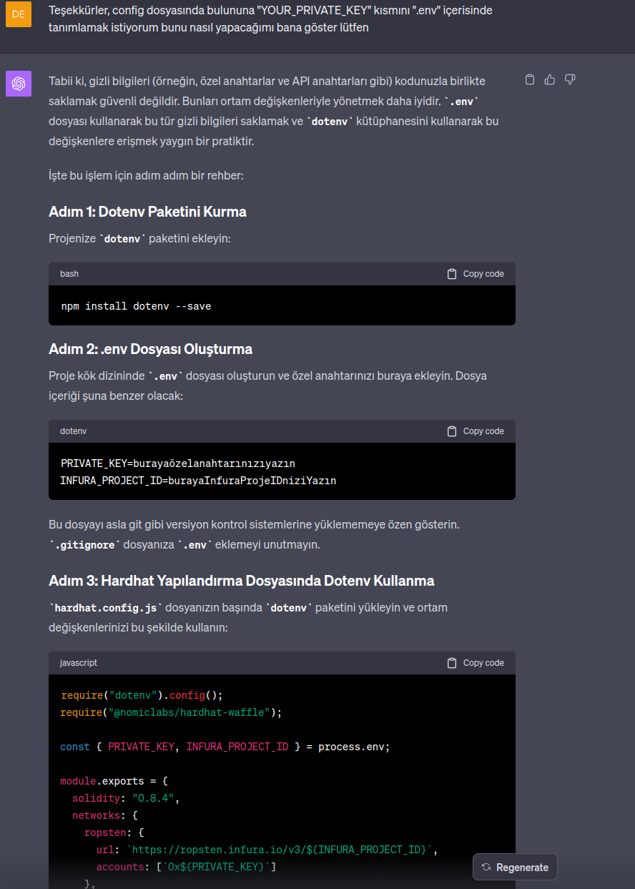
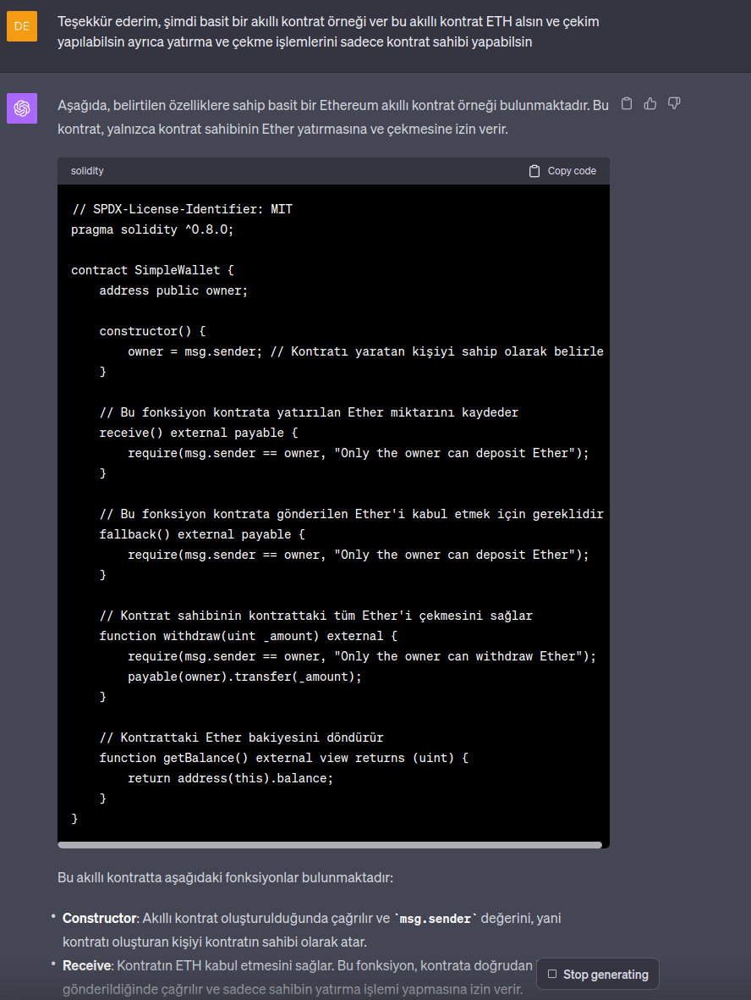

Hiçbir yazılım bilgisine sahip olmadan, ChatGPT kullanarak Scroll ağına bir kontrat yayınlamayı ve onaylamayı nasıl yapabileceğinizi adım adım göstereceğim; hadi promptlarla işe koyulalım...

İlk adım olarak, aklımızdaki fikri yazıya döküyoruz: 

**'Hardhat kullanarak 'X' ağına bir akıllı kontrat yayınlamak istiyorum. Kurulum için gerekli adımları bana verebilir misin?'**



Bize sağlanan kurulum talimatları ve yapmamız gereken işlemlerin listesini sırasıyla uygulayalım.

# Genel Kurulum

## Node.js Kurulumu

Hardhat Node.js üzerinde çalışır, eğer sisteminizde yoksa [Node.js'in resmi web sitesinden](https://nodejs.org/en) indirip kurun.

## Proje Dizini Oluşturma ve Başlatma

Terminalinizi açın ve yeni bir proje dizini oluşturun ve bu dizine gidin:

```bash
mkdir MyHardhatProject
cd MyHardhatProject
```

Node projesini başlatın:

```bash
npm init -y
```

## Hardhat ve Gerekli Paketleri Kurma

Hardhat ve diğer gerekli paketleri projenize ekleyin:

```bash
npm install --save-dev hardhat
```

Eğer OpenZeppelin gibi kontrat kitaplıkları veya ethers.js/waffle gibi test kütüphaneleri kullanacaksanız, bunları da şimdi kurabilirsiniz:

```bash
npm install --save-dev @openzeppelin/contracts ethers chai
```

## Hardhat Projesini Başlatma

Hardhat projesini başlatmak için:

```bash
npx hardhat
```

Bu komut, yapılandırma dosyasını `hardhat.config.js` oluşturmak ve bir örnek akıllı kontrat ve test dosyası eklemek için size bir dizi seçenek sunar.

## Ağ Yapılandırması

`hardhat.config.js` dosyasını düzenleyin ve deploy etmek istediğiniz ağa ilişkin yapılandırmaları ekleyin. Eğer bu Ethereum ana ağı veya bir Ethereum test ağı ise, aşağıdaki gibi bir yapılandırma örneği kullanabilirsiniz:

```js
require("@nomiclabs/hardhat-waffle");

module.exports = {
  solidity: "0.8.4",
  networks: {
    ropsten: {
      url: "https://ropsten.infura.io/v3/YOUR_INFURA_PROJECT_ID", // Infura kullanıyorsanız
      accounts: [`0x${YOUR_PRIVATE_KEY}`] // Private key'inizi buraya ekleyin
    },
    // Diğer ağ yapılandırmalarınız da buraya eklenebilir.
  }
};
```

Kurulum aşamalarını tamamladık ancak özel bilgilerimizi ve private key'leri bir `.env`` dosyasında saklamak daha güvenli olacaktır. ChatGPT'ye soralım:

**'Config dosyasındaki "YOUR_PRIVATE_KEY" bölümünü .env dosyasında nasıl tanımlayacağımı gösterebilir misin lütfen?'**



# Dotenv Kurulumu

## Dotenv Paketini Kurma

Projenize `dotenv` paketini ekleyin:

```bash
npm install dotenv --save
```

## .env Dosyası Oluşturma

Proje kök dizininde `.env` dosyası oluşturun ve özel anahtarınızı buraya ekleyin. Dosya içeriği şuna benzer olacak:

```bash
PRIVATE_KEY=burayaözelanahtarınızıyazın
```

Bu dosyayı asla git gibi versiyon kontrol sistemlerine yüklememeye özen gösterin. `.gitignore` dosyanıza `.env` eklemeyi unutmayın.

## Hardhat Yapılandırma Dosyasında Dotenv Kullanma
`hardhat.config.js` dosyanızın başında dotenv paketini yükleyin ve ortam değişkenlerinizi bu şekilde kullanın:

```js
require("dotenv").config();
require("@nomiclabs/hardhat-waffle");

const { PRIVATE_KEY, INFURA_PROJECT_ID } = process.env;

module.exports = {
  solidity: "0.8.4",
  networks: {
    ropsten: {
      url: `https://ropsten.infura.io/v3/${INFURA_PROJECT_ID}`,
      accounts: [`0x${PRIVATE_KEY}`]
    },
    // Diğer ağ yapılandırmaları
  }
};
```

Bu değişiklikle, `PRIVATE_KEY` ve `INFURA_PROJECT_ID` değerleri .env dosyasından alınacak ve kodunuzun içinde doğrudan görünmeyecek.

## .gitignore Dosyası

Projenizde .gitignore dosyası olduğundan emin olun ve içine .env dosyasını ekleyin, böylece bu dosya yanlışlıkla bir versiyon kontrol sistemine yüklenmez.

`.gitignore` dosyanıza şunları ekleyebilirsiniz:

```gitignore
.env
node_modules/
```

Bu adımları takip ederek, akıllı kontrat geliştirme sırasında ortam değişkenlerinizi güvenli bir şekilde yönetebilir ve kullanabilirsiniz.

Şimdi ise basit bir akıllı kontrat örneği isteyelim:

**'Teşekkür ederim, şimdi basit bir akıllı kontrat örneği ver bu akıllı kontrat ETH alsın ve çekim yapılabilsin ayrıca yatırma ve çekme işlemlerini sadece kontrat sahibi yapabilsin'**



```solidity
// SPDX-License-Identifier: MIT
pragma solidity ^0.8.0;

contract SimpleWallet {
    address public owner;

    constructor() {
        owner = msg.sender; // Kontratı yaratan kişiyi sahip olarak belirle
    }

    // Bu fonksiyon kontrata yatırılan Ether miktarını kaydeder
    receive() external payable {
        require(msg.sender == owner, "Only the owner can deposit Ether");
    }

    // Bu fonksiyon kontrata gönderilen Ether'i kabul etmek için gereklidir
    fallback() external payable {
        require(msg.sender == owner, "Only the owner can deposit Ether");
    }

    // Kontrat sahibinin kontrattaki tüm Ether'i çekmesini sağlar
    function withdraw(uint _amount) external {
        require(msg.sender == owner, "Only the owner can withdraw Ether");
        payable(owner).transfer(_amount);
    }

    // Kontrattaki Ether bakiyesini döndürür
    function getBalance() external view returns (uint) {
        return address(this).balance;
    }
}
```

Bu akıllı kontratta aşağıdaki fonksiyonlar bulunmaktadır:

- **Constructor:** Akıllı kontrat oluşturulduğunda çağrılır ve `msg.sender` değerini, yani kontratı oluşturan kişiyi kontratın sahibi olarak atar.
- **Receive:** Kontratın ETH kabul etmesini sağlar. Bu fonksiyon, kontrata doğrudan Ether gönderildiğinde çağrılır ve sadece sahibin yatırma işlemi yapmasına izin verir.
- **Fallback:** Kontrata fonksiyon çağrısı dışında Ether gönderildiğinde çağrılır ve sadece sahibin yatırma işlemi yapmasına izin verir.
- **Withdraw:** Kontrattaki belirli bir miktarda Ether'i çekmek için kullanılır. Yine sadece sahibin çekim yapmasına izin verir.
- **GetBalance:** Kontratın mevcut Ether bakiyesini döndürür.

Bu kontratı Hardhat ortamınızda kullanarak derleyebilir, test edebilir ve bir Ethereum ağına (ana ağ veya test ağı) deploy edebilirsiniz. Ancak, her zaman gerçek Ether'le çalışmadan önce test ağlarında akıllı kontratlarınızı test etmeniz önerilir.

Akıllı kontratımız şu anda tek bir Solidity dosyası olarak bulunuyor, ancak modüler bir yapı kullanmak daha faydalı olacak:

**Teşekkürler, şimdi şunu yapmanı istiyorum; yatırma ve çekme işlemlerini yapan fonksiyonları farklı Solidity dosyalarında sakla ve ana kontrattan bu kodlar içeri al lütfen.**

Akıllı kontrat kodunu modüler hale getirmek ve yeniden kullanılabilirlik sağlamak için, fonksiyonları farklı Solidity dosyalarında saklayabilir ve bunları bir ana kontrat dosyası içerisinden import edebilirsiniz. İşte bu işlemi nasıl yapabileceğiniz aşağıda açıklanmıştır:

Öncelikle yatırma işlemlerini gerçekleştiren `Deposit.sol` adında bir dosya oluşturun:

```solidity
// SPDX-License-Identifier: MIT
pragma solidity ^0.8.0;

// Deposit.sol
contract Deposit {
    // Bu fonksiyon kontrata yatırılan Ether miktarını kaydeder
    receive() external payable {
    }

    // Bu fonksiyon kontrata gönderilen Ether'i kabul etmek için gereklidir
    fallback() external payable {
    }
}
```

Ardından, çekme işlemlerini gerçekleştiren `Withdraw.sol` adında bir dosya oluşturun:

```solidity
// SPDX-License-Identifier: MIT
pragma solidity ^0.8.0;

// Withdraw.sol
contract Withdraw {
    address internal owner;

    constructor() {
        owner = msg.sender;
    }

    // Kontrat sahibinin kontrattaki tüm Ether'i çekmesini sağlar
    function withdraw(uint _amount) external {
        require(msg.sender == owner, "Only the owner can withdraw Ether");
        payable(msg.sender).transfer(_amount);
    }
}
```
Ve son olarak, bu iki kontratı içe aktarıp kullanan ana `Wallet.sol` kontratını oluşturun:

```solidity
// SPDX-License-Identifier: MIT
pragma solidity ^0.8.0;

import "./Deposit.sol";
import "./Withdraw.sol";

// Wallet.sol
contract Wallet is Deposit, Withdraw {
    // Kontrattaki Ether bakiyesini döndürür
    function getBalance() external view returns (uint) {
        return address(this).balance;
    }
}
```

Bu yapılandırmada, Deposit ve Withdraw kontratları ayrı Solidity dosyalarında tanımlanmış ve Wallet kontratı tarafından extend edilmiştir (is anahtar kelimesiyle). `Wallet` kontratı, `Deposit` ve `Withdraw` kontratlarının özelliklerini ve fonksiyonlarını miras alır ve birleştirir. Wallet kontratı aynı zamanda kendi özgün getBalance fonksiyonuna da sahiptir.

Kontratı başarıyla oluşturduktan sonra, şimdi sıra bu akıllı kontratı Etherscan üzerinde doğrulamaya geldi. Bu nedenle ChatGPT'ye şöyle sorayım: 

**'Teşekkürler, deploy işlemini tamamladık. Şimdi Etherscan veya benzeri platformlarda akıllı kontratımızın doğrulanmasını nasıl gerçekleştirebilirim?'**

Etherscan'da bir akıllı kontratı doğrulamak (verify), akıllı kontratın kaynak kodunu blok zincirindeki herkesin görebilmesini ve kodu okuyup etkileşimde bulunabilmelerini sağlar. Bu işlem, kontratın şeffaflığını ve güvenilirliğini artırır. Etherscan üzerinde bir kontratı doğrulamak için genellikle aşağıdaki adımları izlersiniz:

### Doğrulama Adımları:

- Kontrat Adresi: Deploy edilen akıllı kontratın adresini bilmeniz gerekiyor.

- Kaynak Kodu: Akıllı kontratın tam kaynak kodunu, import edilen tüm dosyalarla birlikte hazır bulundurmalısınız.

- Compiler Sürümü: Kontratı deploy ederken kullanılan Solidity compiler'ın sürümü kesinlikle aynı olmalıdır.

- Optimizasyon Ayarları: Eğer kontrat deploy edilirken optimizasyon kullanıldıysa, aynı optimizasyon ayarlarını kullanmalısınız.

- Constructor Argümanları: Eğer kontratın bir constructor fonksiyonu varsa ve parametre alıyorsa, deploy ederken kullanılan parametrelerin ABI-encoded versiyonuna ihtiyacınız olacak.

- Flattened Kod: Eğer kontratınız birden fazla dosyadan oluşuyorsa, Etherscan genellikle tek bir dosya şeklinde düzleştirilmiş (flattened) kod bekler. Flattened kod, tüm import edilen dosyaların tek bir dosya içinde birleştirilmiş halidir.

- Lisans: Etherscan, doğrulama sırasında kontratın hangi lisans altında yayınlandığını bilmek ister. Doğru lisansı seçmelisiniz.

### Doğrulama İşlemi:

Bu bilgilere sahip olduktan sonra doğrulama işlemi için genellikle aşağıdaki adımları takip edersiniz:

1. Etherscan türevi olan ve deploy edilen ağa ait blokzinciri gezginine gidin (örneğin: Ropsten için ropsten.etherscan.io).

2. Akıllı kontratın adresini arama çubuğuna yapıştırın ve kontrat sayfasını açın.

3. "Contract" sekmesine tıklayın ve "Verify and Publish" linkine tıklayın.

Gerekli bilgileri doldurun:

4. Compiler sürümünü seçin.
Optimizasyon kullanılıp kullanılmadığını ve ayarlarını belirtin.
Kaynak kodunu, constructor parametrelerini (varsa), ve diğer gereken bilgileri girin.
"Verify and Publish" butonuna tıklayarak süreci tamamlayın.

Eğer Hardhat kullanıyorsanız, bu işlemi otomatikleştirmek için hardhat-etherscan eklentisini kullanabilirsiniz. Eklentiyi projenize dahil ettikten sonra, Hardhat script'i üzerinden doğrulama yapabilirsiniz. İlk olarak eklentiyi yükleyin:

```bash
npm install --save-dev @nomiclabs/hardhat-etherscan
```

`hardhat.config.js` dosyasında eklentiyi yapılandırın ve Etherscan API anahtarınızı ekleyin:

```js
require("@nomiclabs/hardhat-etherscan");

module.exports = {
  // ... diğer yapılandırmalar
  etherscan: {
    apiKey: "ETHERSCAN_API_KEY"
  }
};
```

Deployment script'inizi çalıştırdıktan sonra, kontratı Hardhat ile doğrulayabilirsiniz:

```bash
npx hardhat verify --network <network_name> DEPLOYED_CONTRACT_ADDRESS "Constructor argument 1"
```

`<network_name>` yerine kullanmak istediğiniz ağı (örneğin mainnet, ropsten, rinkeby vb.), `DEPLOYED_CONTRACT_ADDRESS` yerine kontratınızın adresini, ve eğer varsa constructor argümanlarını ekleyin.

Bu komut otomatik olarak gerekli bilgileri Etherscan'a gönderir ve doğrulama işlemini başlatır.